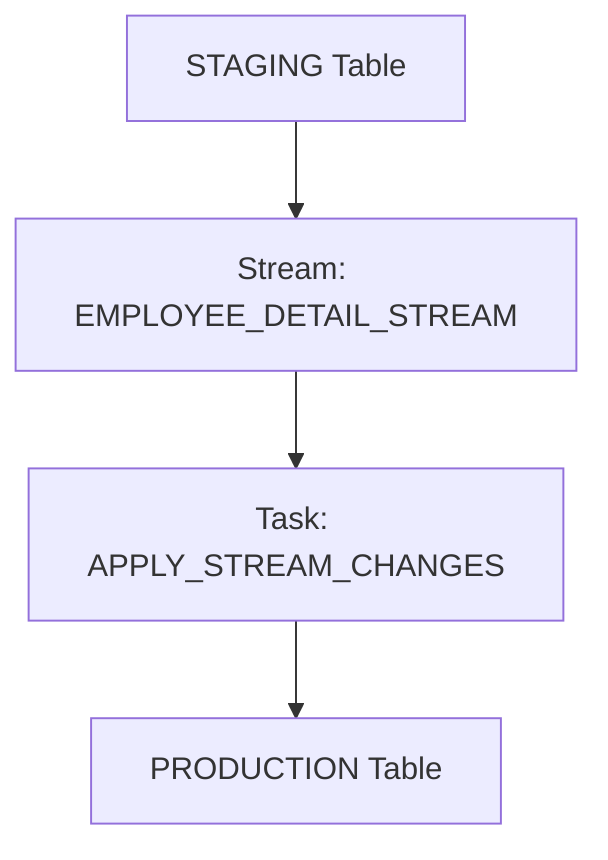

# 📊 Snowflake Stream & Tasks: Change Tracking Demo


---
## 🛠️ Overview
This repository demonstrates Change Data Capture (CDC) using Snowflake Streams and Tasks to keep a PRODUCTION table in sync with STAGING.
You will learn how to:

Create Streams to track changes (INSERT, UPDATE, DELETE)
Apply changes to a target table using MERGE
Automate CDC with Snowflake Tasks

---

## 🔗 Architecture

## ✅ Features
- Create Stream on STAGING table to track changes (INSERT, UPDATE, DELETE)
- Insert sample data into STAGING
- Move data to PROD
- Apply updates and consume stream changes using MERGE
- Automate with Snowflake Task

🚀 Steps
1. Create Database, Warehouse and schemas
```
CREATE DATABASE IF NOT EXISTS HR_DATALAKE;
CREATE WAREHOUSE IF NOT EXISTS COMPUTE_WH WAREHOUSE_SIZE = 'XSMALL';

-- CREATE STAGING SCHEMAS
USE DATABASE HR_DATALAKE;
CREATE SCHEMA IF NOT EXISTS STAGING;

-- CREATE PRODUCTION SCHEMAS
USE DATABASE HR_DATALAKE;
CREATE SCHEMA IF NOT EXISTS PRODUCTION;
```
2. Create staging Table employee_detail
```CREATE OR REPLACE TABLE HR_DATALAKE.STAGING.EMPLOYEE_DETAIL (

    EMPLOYEE_ID NUMBER,
    FIRST_NAME STRING,
    LAST_NAME STRING,
    EMAIL STRING,
    HIRE_DATE DATE,
    DEPARTMENT_NAME STRING,
    JOB_TITLE STRING,
    COST_CENTER STRING,
    LOCATION STRING,
    MANAGER_NAME STRING,
    EMPLOYMENTSTATUS STRING,
    ISACTIVE BOOLEAN
);
```
3. Insert test data
```
INSERT INTO HR_DATALAKE.STAGING.EMPLOYEE_DETAIL (
    EMPLOYEE_ID, FIRST_NAME, LAST_NAME, EMAIL, HIRE_DATE, DEPARTMENT_NAME, JOB_TITLE, COST_CENTER, LOCATION, MANAGER_NAME, EMPLOYMENTSTATUS, ISACTIVE
) VALUES
(1001, 'Alice', 'Johnson', 'alice.johnson@corp.com', '2020-03-15', 'HR', 'HR Specialist', 'CC101', 'San Francisco', 'Robert Smith', 'Full-Time', TRUE),
(1002, 'Brian', 'Lee', 'brian.lee@corp.com', '2019-07-22', 'Finance', 'Financial Analyst', 'CC102', 'New York', 'Susan Clark', 'Full-Time', TRUE),
(1003, 'Carla', 'Gomez', 'carla.gomez@corp.com', '2021-01-10', 'IT', 'Systems Engineer', 'CC103', 'Austin', 'David Brown', 'Full-Time', TRUE),
(1004, 'Daniel', 'Patel', 'daniel.patel@corp.com', '2018-11-05', 'Marketing', 'Marketing Manager', 'CC104', 'Chicago', 'Emily Davis', 'Full-Time', TRUE),
(1005, 'Emma', 'Wright', 'emma.wright@corp.com', '2022-06-18', 'HR', 'Recruiter', 'CC101', 'Los Angeles', 'Robert Smith', 'Full-Time', TRUE);
SELECT * FROM HR_DATALAKE.STAGING.EMPLOYEE_DETAIL
```


4. Create stream on staging table
```
CREATE OR REPLACE STREAM HR_DATALAKE.STAGING.EMPLOYEE_DETAIL_STREAM
ON TABLE HR_DATALAKE.STAGING.EMPLOYEE_DETAIL;
SELECT * FROM HR_DATALAKE.STAGING.EMPLOYEE_DETAIL_STREAM
```


5. Create target table on production and fill 
```
CREATE OR REPLACE TABLE HR_DATALAKE.PRODUCTION.EMPLOYEE_DETAIL AS
SELECT * FROM HR_DATALAKE.STAGING.EMPLOYEE_DETAIL WHERE 1=0; 
```
6. move data from staging to production table
```
INSERT INTO HR_DATALAKE.PRODUCTION.EMPLOYEE_DETAIL
SELECT * FROM HR_DATALAKE.STAGING.EMPLOYEE_DETAIL;
```
7. Insert and udpate data on staging table
```
INSERT INTO HR_DATALAKE.STAGING.EMPLOYEE_DETAIL (
    EMPLOYEE_ID, FIRST_NAME, LAST_NAME, EMAIL, HIRE_DATE, DEPARTMENT_NAME, JOB_TITLE, COST_CENTER, LOCATION, MANAGER_NAME, EMPLOYMENTSTATUS, ISACTIVE
) VALUES
(1006, 'Victor', 'Nelson', 'victor.nelson@corp.com', '2024-07-10', 'IT', 'Machine Learning Engineer', 'CC103', 'San Jose', 'David Brown', 'Full-Time', TRUE);

INSERT INTO HR_DATALAKE.STAGING.EMPLOYEE_DETAIL (
    EMPLOYEE_ID, FIRST_NAME, LAST_NAME, EMAIL, HIRE_DATE, DEPARTMENT_NAME, JOB_TITLE, COST_CENTER, LOCATION, MANAGER_NAME, EMPLOYMENTSTATUS, ISACTIVE
) VALUES
(1007, 'Sophia', 'Martinez', 'sophia.martinez@corp.com', '2023-11-03', 'Finance', 'Risk Analyst', 'CC102', 'Philadelphia', 'Susan Clark', 'Full-Time', TRUE);

UPDATE HR_DATALAKE.STAGING.EMPLOYEE_DETAIL
SET JOB_TITLE = 'HR Manager'
WHERE EMPLOYEE_ID = 1001;

SELECT * FROM HR_DATALAKE.STAGING.EMPLOYEE_DETAIL_STREAM
```


8. Consume streams apply changes to production
```
MERGE INTO HR_DATALAKE.PRODUCTION.EMPLOYEE_DETAIL AS T
USING (
    SELECT *
    FROM (
        SELECT S.*, ROW_NUMBER() OVER (PARTITION BY EMPLOYEE_ID ORDER BY METADATA$ROW_ID DESC) AS rn
        FROM HR_DATALAKE.STAGING.EMPLOYEE_DETAIL_STREAM AS S
        WHERE METADATA$ACTION IN ('INSERT', 'DELETE')
    )
    WHERE rn = 1
) AS S
ON T.EMPLOYEE_ID = S.EMPLOYEE_ID

WHEN MATCHED AND S.METADATA$ACTION = 'DELETE' THEN
    DELETE

WHEN MATCHED AND S.METADATA$ACTION = 'INSERT' THEN
    UPDATE SET
        T.FIRST_NAME = S.FIRST_NAME,
        T.LAST_NAME = S.LAST_NAME,
        T.EMAIL = S.EMAIL,
        T.HIRE_DATE = S.HIRE_DATE,
        T.DEPARTMENT_NAME = S.DEPARTMENT_NAME,
        T.JOB_TITLE = S.JOB_TITLE,
        T.COST_CENTER = S.COST_CENTER,
        T.LOCATION = S.LOCATION,
        T.MANAGER_NAME = S.MANAGER_NAME,
        T.EMPLOYMENTSTATUS = S.EMPLOYMENTSTATUS,
        T.ISACTIVE = S.ISACTIVE

WHEN NOT MATCHED AND S.METADATA$ACTION = 'INSERT' THEN
    INSERT (
        EMPLOYEE_ID, FIRST_NAME, LAST_NAME, EMAIL, HIRE_DATE, DEPARTMENT_NAME, JOB_TITLE, COST_CENTER, LOCATION, MANAGER_NAME, EMPLOYMENTSTATUS, ISACTIVE
    )
    VALUES (
        S.EMPLOYEE_ID, S.FIRST_NAME, S.LAST_NAME, S.EMAIL, S.HIRE_DATE, S.DEPARTMENT_NAME, S.JOB_TITLE, S.COST_CENTER, S.LOCATION, S.MANAGER_NAME, S.EMPLOYMENTSTATUS, S.ISACTIVE
    );

```
9.Verify production Table
```
SELECT * FROM HR_DATALAKE.PRODUCTION.EMPLOYEE_DETAIL;


```
10.create task to read data from stream and schedule-to run
```
CREATE OR REPLACE TASK HR_DATALAKE.STAGING.STREAM_TO_PRODUCTION_TASK
WAREHOUSE = COMPUTE_WH
SCHEDULE = '5 MINUTE'
WHEN SYSTEM$STREAM_HAS_DATA('HR_DATALAKE.STAGING.EMPLOYEE_DETAIL_STREAM')
AS
MERGE INTO HR_DATALAKE.PRODUCTION.EMPLOYEE_DETAIL AS T
USING (
    SELECT *
    FROM (
        SELECT S.*, ROW_NUMBER() OVER (PARTITION BY EMPLOYEE_ID ORDER BY METADATA$ROW_ID DESC) AS rn
        FROM HR_DATALAKE.STAGING.EMPLOYEE_DETAIL_STREAM AS S
        WHERE METADATA$ACTION IN ('INSERT', 'DELETE')
    )
    WHERE rn = 1
) AS S
ON T.EMPLOYEE_ID = S.EMPLOYEE_ID
WHEN MATCHED AND S.METADATA$ACTION = 'DELETE' THEN DELETE
WHEN MATCHED AND S.METADATA$ACTION = 'INSERT' THEN
    UPDATE SET
        T.FIRST_NAME = S.FIRST_NAME,
        T.LAST_NAME = S.LAST_NAME,
        T.EMAIL = S.EMAIL,
        T.HIRE_DATE = S.HIRE_DATE,
        T.DEPARTMENT_NAME = S.DEPARTMENT_NAME,
        T.JOB_TITLE = S.JOB_TITLE,
        T.COST_CENTER = S.COST_CENTER,
        T.LOCATION = S.LOCATION,
        T.MANAGER_NAME = S.MANAGER_NAME,
        T.EMPLOYMENTSTATUS = S.EMPLOYMENTSTATUS,
        T.ISACTIVE = S.ISACTIVE
WHEN NOT MATCHED AND S.METADATA$ACTION = 'INSERT' THEN
    INSERT (
        EMPLOYEE_ID, FIRST_NAME, LAST_NAME, EMAIL, HIRE_DATE, DEPARTMENT_NAME, JOB_TITLE, COST_CENTER, LOCATION, MANAGER_NAME, EMPLOYMENTSTATUS, ISACTIVE
    )
    VALUES (
        S.EMPLOYEE_ID, S.FIRST_NAME, S.LAST_NAME, S.EMAIL, S.HIRE_DATE, S.DEPARTMENT_NAME, S.JOB_TITLE, S.COST_CENTER, S.LOCATION, S.MANAGER_NAME, S.EMPLOYMENTSTATUS, S.ISACTIVE
    );

-- Start the task
ALTER TASK HR_DATALAKE.STAGING.STREAM_TO_PRODUCTION_TASK RESUME;
```
11.Insert sample data on staging 
```
INSERT INTO HR_DATALAKE.STAGING.EMPLOYEE_DETAIL (
    EMPLOYEE_ID, FIRST_NAME, LAST_NAME, EMAIL, HIRE_DATE, DEPARTMENT_NAME, JOB_TITLE, COST_CENTER, LOCATION, MANAGER_NAME, EMPLOYMENTSTATUS, ISACTIVE
) VALUES
(1008, 'Liam', 'Anderson', 'liam.anderson@corp.com', '2024-03-20', 'Operations', 'Supply Chain Analyst', 'CC106', 'Denver', 'Karen White', 'Full-Time', TRUE);
```
12.Check the task run history 

13.Validate the data in Production table 
```
SELECT * FROM HR_DATALAKE.PRODUCTION.EMPLOYEE_DETAIL;
```


## 📂 Repo Structure
```
SNOWFLAKE STREAM & TASKS – (CHANGE TRACKING)/
│
├── README.md
├── sql/
│   ├── 01_create_database_warehouse_schema.sql
│   ├── 02_create_tables.sql
│   ├── 03_insert_data.sql
│   ├── 04_create_stream_on_staging_table.sql
│   ├── 05_create_target_table_on_production.sql
│   ├── 06_move_data_from_staging_to_production.sql
│   ├── 07_insert_and_update_data_on_staging.sql
│   ├── 08_consume_streams_apply_changes_to_production.sql
│   ├── 09_verify_production_table.sql

```
